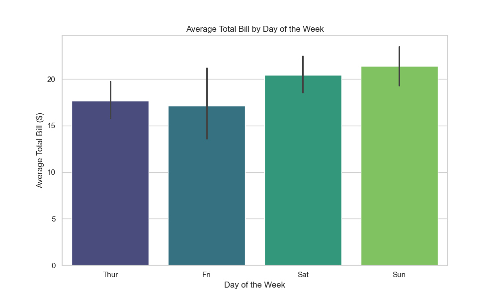
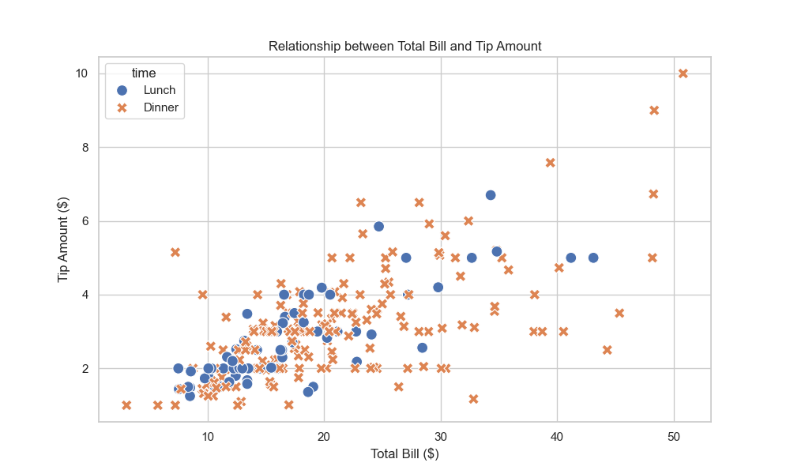
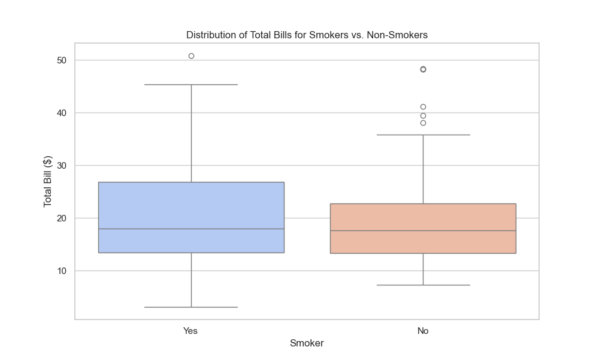
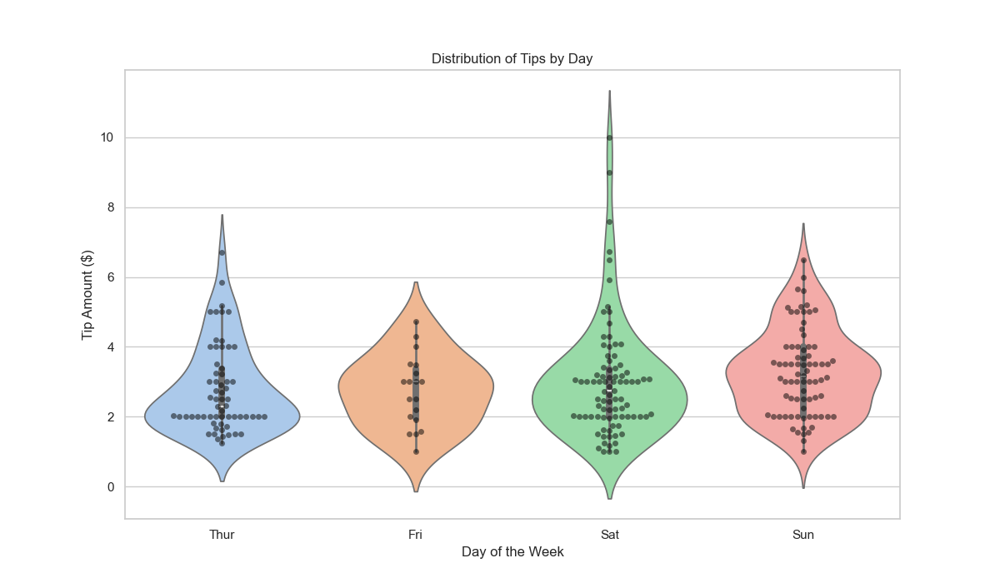
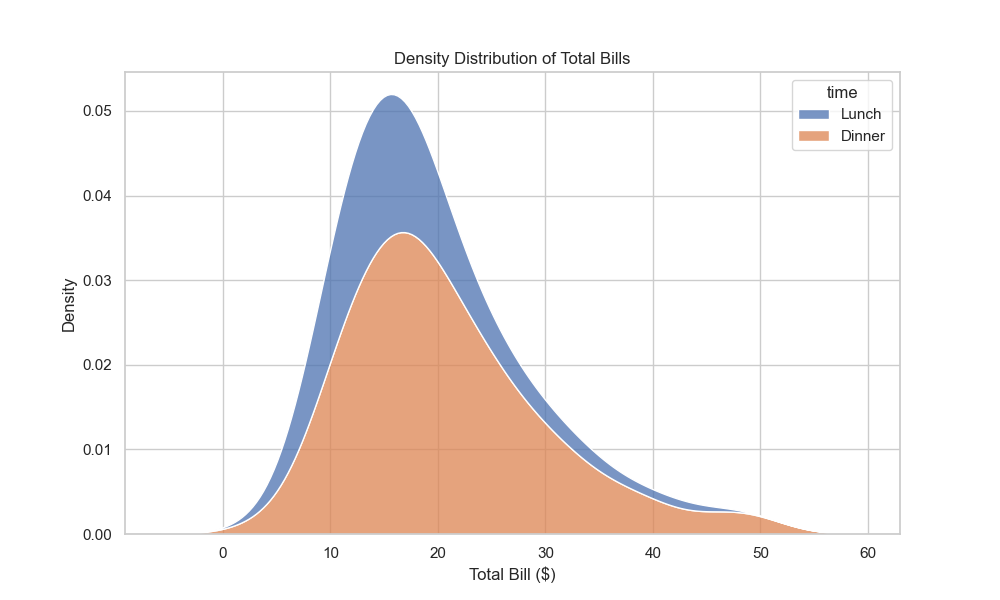

# Seaborn Data Analysis on the Tips Dataset

## 📜 Description

This project involves a comprehensive analysis of the "Tips" dataset using Python's data visualization libraries, Seaborn and Matplotlib. The goal is to uncover patterns and relationships within the data, such as customer spending habits based on the day of the week, party size, and other attributes.

The dataset contains information about tips received by a waiter in a restaurant over a few months.

---

## 📊 Visualizations and Insights

Here are some of the key visualizations created from the dataset, along with the insights derived from them.

### 1. Average Total Bill by Day of the Week

* **Observation:** The average total bill is highest on Sunday, followed closely by Saturday.
* **Insight:** This suggests that customers tend to spend more on weekends, which are likely the busiest days for the restaurant.

### 2. Relationship between Total Bill and Tip Amount

* **Observation:** There is a clear positive linear relationship between the total bill and the tip amount.
* **Insight:** As expected, higher bills result in higher tips. The plot also shows that dinner bills are generally higher than lunch bills.

### 3. Distribution of Total Bills for Smokers vs. Non-Smokers

* **Observation:** The median bill for both groups is similar, but the spending range for smokers is wider and includes more high-value outliers.
* **Insight:** While the typical bill is the same, smoking parties show greater variability in their spending.

### 4. Distribution of Tips by Day

* **Observation:** The distributions for Saturday and Sunday are wider, indicating more tips were recorded on these days.
* **Insight:** The restaurant is busiest on weekends. Most tips, regardless of the day, are concentrated in the $2 to $4 range.

### 5. Density Distribution of Total Bills

* **Observation:** The distribution of total bills is right-skewed, with a peak around $15-$20.
* **Insight:** Most customers have modest bills, while a few parties spend much more, creating a long tail. Dinner bills are generally higher than lunch bills.

---

## 💻 Code and Files

* **Jupyter Notebook (`.ipynb`):** Contains all the Python code used for data loading, processing, and visualization.
* **Dataset (`.csv`):** The raw data file used for this analysis.
